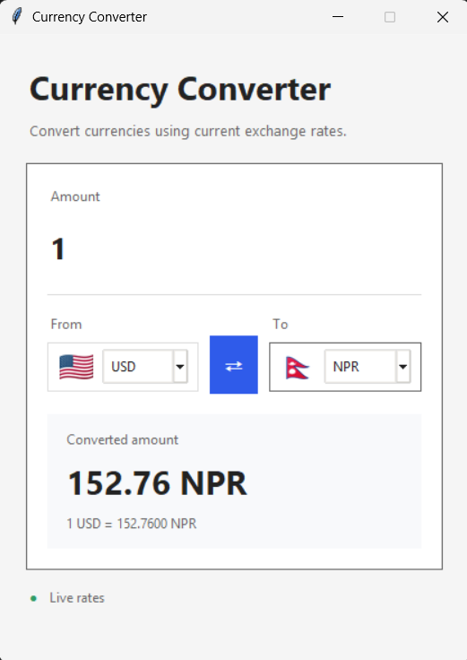

# # Currency Converter


**Currency Converter** is a modern desktop application built using **Python** and **Tkinter**. 
> **Note :** It provides fast and accurate real-time currency conversion through the ExchangeRate API with a clean, responsive, and user-friendly graphical interface.

---

## # Screenshot

<p align="left">
  
</p>

---

## # Features

- Real-time currency conversion
- Live exchange rate updates
- Support for multiple international currencies
- Modern Tkinter graphical interface
- Country flag integration
- Currency swap functionality
- Automatic input validation
- Simple and user-friendly design

---

## # Tech Stack

- **Language:** Python
- **GUI Framework:** Tkinter
- **API:** ExchangeRate API
- **HTTP Client:** Requests
- **Image Processing:** Pillow (PIL)
- **Utilities:** JSON, Threading

---

## # Project Structure

```text
currency-converter/
├── app.py
├── screenshots/
│   └── currency-converter.png
├── requirements.txt
└── README.md
```

---

## # Getting Started

Clone the repository:

```bash
git clone https://github.com/dineshsinghdhami/currency-converter.git
cd currency-converter
```

Install dependencies:

```bash
pip install -r requirements.txt
```

Run the application:

```bash
python app.py
```

---

## # Contributing

Contributions are welcome and appreciated!

If you'd like to improve this project, you are welcome to:

- Fork the repository
- Create a new feature branch
- Make your improvements
- Submit a Pull Request
- Report bugs or suggest new features through GitHub Issues

Please write clean, well-documented code and ensure your changes do not break existing functionality.

---

## # License

This project is available for everyone to use, modify, and learn from.

Feel free to:

- Use it for personal projects
- Use it for educational purposes
- Fork the repository
- Modify the source code
- Share your improvements
- Contribute through Pull Requests

If you use this project, giving credit to the original repository is appreciated but not required.

---

## # Author

**Dinesh Singh Dhami**

- Website: https://dineshsinghdhami.com.np
- GitHub: https://github.com/dineshsinghdhami
- Email: dineshdhamidn@gmail.com