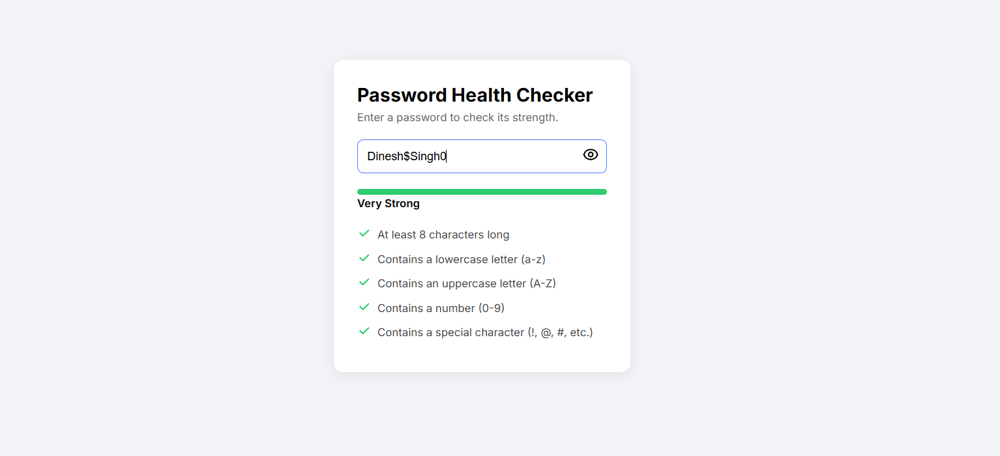

# 🔐 Password Strength Checker

[]()
[]()
[]()

A modern **Password Health Checker Web App** created with **HTML**, **CSS**, and **JavaScript**.

---

## 🚀 Live Demo

🔗 **[View Live Project](https://dineshsinghdhami.github.io/password-strength-checker/)**

---

## ✨ Features

✅ Real-time password strength analysis  
🔍 Checks lowercase, uppercase, numbers, symbols, and length  
📊 Dynamic strength meter (Weak → Very Strong)  
✔️ Live requirement checklist with tick & cross icons  
👁️ Show/Hide password toggle  
⚡ Smooth animations & clean UI

---

## 🧠 How to Use

1. Visit the live demo:  
   👉 https://dineshsinghdhami.com.np/password-strength-checker/

2. Type any password into the input field.  
3. Watch the **strength meter** and **checklist** update instantly.  
4. Improve your password until it becomes **Very Strong** ✔️

---

## 🖼️ Screenshot



---

## 📁 Project Structure

```
password-strength-checker/
│
├── index.html                   
├── readme.md                      
├── password-strength-checker.png  
└── assets/                       
```

---

## 📜 Password Requirements Checked

- Minimum **8 characters**
- At least **one lowercase letter**
- At least **one uppercase letter**
- At least **one number**
- At least **one special character**

---


## 🛠️ Built With

- **HTML**
- **CSS**
- **JavaScript**

---

## ⚙️ How It Works

- JavaScript captures input events  
- Regex patterns validate each rule  
- A score is calculated out of 100  
- Strength bar updates color + width  
- Checklist switches between ✔️ / ❌ based on rules  

---

## 👨‍💻 Author

**Dinesh Singh Dhami**  
📧 Email: dineshdhamidn@gmail.com  
🌐 Portfolio: https://www.dineshsinghdhami.com.np  
💼 LinkedIn: https://linkedin.com/in/dineshsinghdhami1  
🐙 GitHub: https://github.com/dineshsinghdhami  

---

## ©️ Copyright

- All rights reserved © 2025 **Dinesh Singh Dhami**  
- Free for personal & educational use  
- Contact for commercial usage or redistribution  

---
