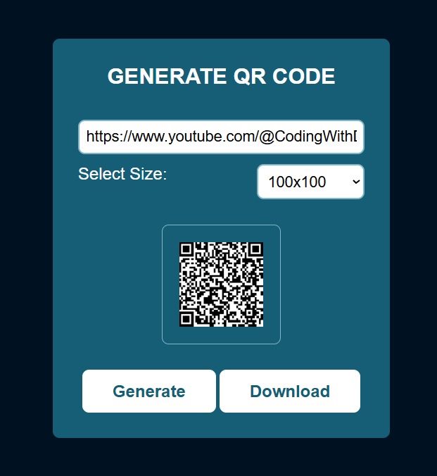

# 🔲 QR Code Generator

A simple and responsive **QR Code Generator** built using **HTML, CSS, and JavaScript**.  

---

## 🚀 Features

- 📝 Generate QR codes from text or URLs  
- 📏 Select from multiple size options (100x100 to 1000x1000)  
- 💾 Download the generated QR code as an image  
- ⚡ Real-time regeneration when size changes  
- 🎨 Clean and modern UI design  

---

## 📸 Preview

  

---

## 🛠️ Technologies Used

- **HTML**   
- **CSS**  
- **JavaScript**

---

## 📁 Project Structure

```
qr-code-generator/
│
├── index.html
├── style.css
├── script.js
└── screenshot.png
```

---

## ©️ Copyright

- All rights reserved © 2025 **[Dinesh Singh Dhami](https://www.dineshsinghdhami.com.np)**
- This project is licensed for personal and educational use.
- For commercial use or redistribution, please contact the owner.
