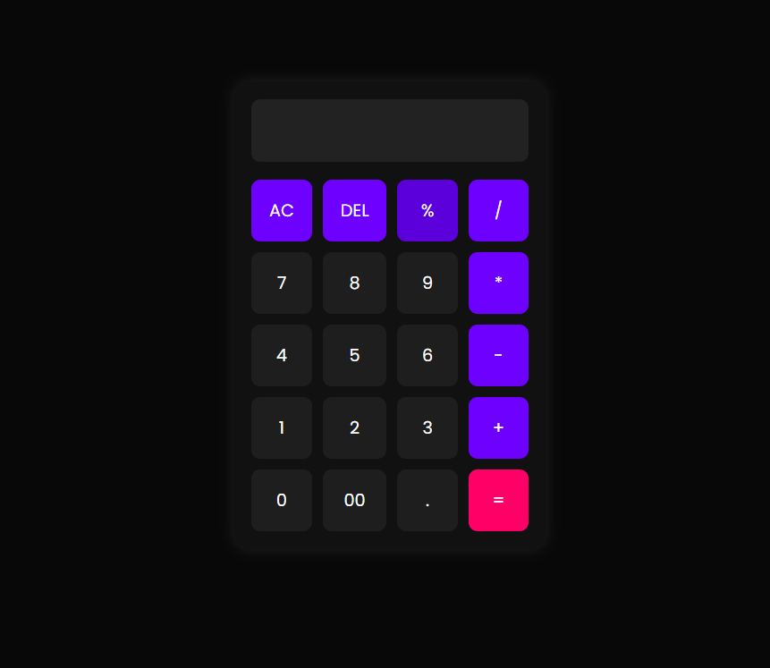

# Calculator - By thecodingdhami

A simple, responsive, and modern **Calculator** built with HTML, CSS, and JavaScript. It supports basic arithmetic, percentage calculations, and keyboard input for easy use.


---

## 🌟 Features

* ✅ Basic Operations: Addition, Subtraction, Multiplication, Division
* ✅ Additional Functions: Percent (`%`), Clear (`AC`), Delete (`DEL`)
* ✅ Responsive Design: Works on desktops, tablets, and mobile devices
* ✅ Keyboard Support: Type numbers and operators directly from your keyboard
* ✅ Modern UI: Gradient buttons, smooth hover effects, and animated input

---

## 🖼 Screenshots

[](Calculator.png)

---

## 📁 Project Structure

```
simple-calculator/
│
├── index.html
├── style.css
├── script.js
└── screenshot.png
```

---

## 🛠️ Technologies Used

| Technology | Badge |
|------------|-------|
| HTML      |  |
| CSS       |  |
| JavaScript |  | 

---

## ©️ Copyright

- All rights reserved © 2025 **[Dinesh Singh Dhami](https://www.dineshsinghdhami.com.np)**
- This project is licensed for personal and educational use.
- For commercial use or redistribution, please contact the owner.

