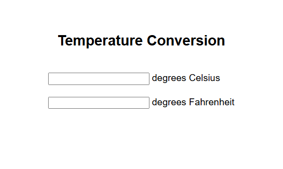

# 🌡️ Temperature Converter

A simple and clean **Temperature Conversion** tool built using **HTML, CSS, and JavaScript**. 

---

## 🔹 Features

- 💡 User-friendly interface — clean and simple to use.
- 🌡️ Convert between Celsius (°C) and Fahrenheit (°F).
- ⚡ Instant conversion with real-time calculation.
  
---

## 📸 Screenshot

  

---

## 📁 Project Structure

```
Temperature-Converter/
│
├── index.html
├── style.css
├── script.js
└── screenshot.png
```

---

## 💻 How to Use

1. Open the [Live Preview](https://dineshsinghdhami.github.io/temperature-converter/) in your browser.  
2. Enter the temperature value you want to convert.  
3. Select the **unit you want to convert from** and **unit to convert to**.  
4. Click the **Convert** button to see the result instantly.  

---

## 🛠️ Technologies Used

| Technology | Badge |
|------------|-------|
| HTML      |  |
| CSS       |  |
| JavaScript |  |

---

## ©️ Copyright

- All rights reserved © 2025 **[Dinesh Singh Dhami](https://www.dineshsinghdhami.com.np)**
- This project is licensed for personal and educational use.
- For commercial use or redistribution, please contact the owner.
