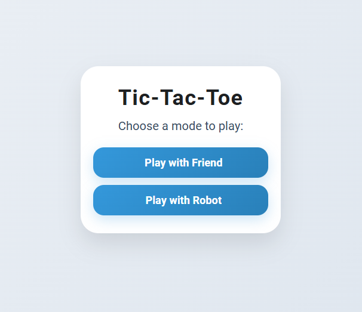

# 🎮 Tic-Tac-Toe Game

A **modern, responsive, and futuristic Tic-Tac-Toe** game built with **HTML, CSS & JavaScript**. 

---

## ✨ Features

- Restart game anytime.  
- Futuristic neon glow design. 
- Play with a friend or robot (AI).
-  Go back to the main page if needed.  
- Winning cells highlight with glowing effect.  
- Responsive for **mobile, tablet, and desktop**. 

---

## 📸 Screenshots

---

## 🕹 How to Play

1. Open `(https://dineshsinghdhami.com.np/Tic-Tac-Toe/)` in your browser.  
2. Choose **game mode** (friend or robot).  
3. Click on empty cells to place your symbol (D or S).  
4. First player to get 3 in a row **wins**!  
5. Click **Restart Game** to play again anytime.  

---
## 🛠️ Technologies Used

| Technology | Badge |
|------------|-------|
| HTML      |  |
| CSS       |  |
| JavaScript |  | 

---

## ©️ Copyright

- All rights reserved © 2025 **[Dinesh Singh Dhami](https://www.dineshsinghdhami.com.np)**
- This project is licensed for personal and educational use.
- For commercial use or redistribution, please contact the owner.
