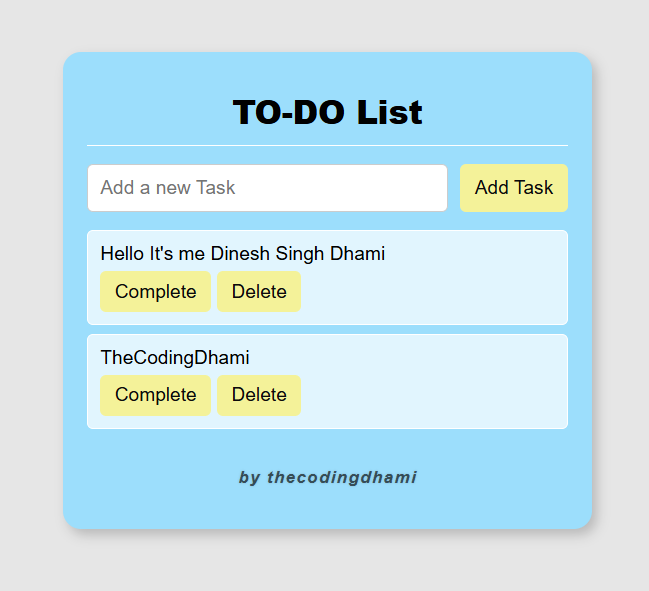

# TO-DO List App

A simple, responsive, and interactive **To-Do List web application** built with HTML, CSS, and JavaScript.


---

## Features

- **Add Tasks & Delete Tasks.** 
- **Mark as Complete / Undo.**  
- **Persistent Storage.** 
- **Responsive Design.**
  
---

## Screenshots



---

## Technologies Used

- **HTML**  
- **CSS** (Responsive and mobile-friendly)  
- **JavaScript** (DOM manipulation, `localStorage`)  

---

## Folder Structure

```
todo-list/
│
├─ index.html
├─ style.css
├─ script.js
└─ README.md
```

---

## Usage

1. Type a task in the input field.  
2. Press **Enter** or click **Add Task**.  
3. Click **Complete** to mark it as done or **Undo** to unmark.  
4. Click **Delete** to remove a task.  
5. Your tasks are saved automatically and will remain after refreshing the page.
   
---

## ©️ Copyright

- All rights reserved © 2025 **[Dinesh Singh Dhami](https://www.dineshsinghdhami.com.np)**
- This project is licensed for personal and educational use.
- For commercial use or redistribution, please contact the owner.
